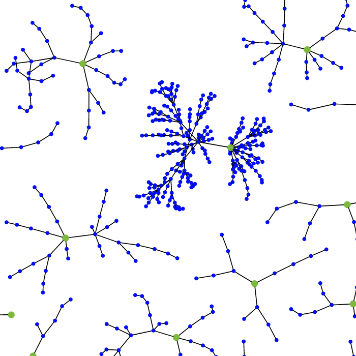
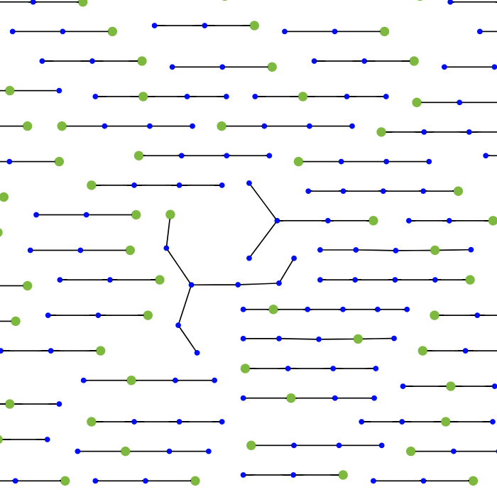

# Local Search for NAS

[Local Search is State of the Art for Neural Architecture Search Benchmarks](https://arxiv.org/abs/2005.02960)\
Colin White, Sam Nolen, and Yash Savani.\
_arXiv:2005.02960_.

We study the simplest versions of local search, showing that local search achieves state-of-the-art results on NASBench-101 (size 10^6) and NASBench-201 (size 10^4). We also show that local search fails on the DARTS search space (size 10^18). This suggests that existing NAS benchmarks may be too small to adequately evaluate NAS algorithms. See our paper for a theoretical study which characterizes the performance of local search on graph optimization problems, backed by simulation results.

<p align="center">
  
  
</p>

## Requirements
This repo is our fork of [naszilla/bananas](https://github.com/naszilla/bananas/). The requirements are as follows.
- jupyter
- tensorflow == 1.14.0
- nasbench (follow the installation instructions [here](https://github.com/google-research/nasbench))
- nas-bench-201 (follow the installation instructions [here](https://github.com/D-X-Y/NAS-Bench-201))
- pytorch == 1.2.0, torchvision == 0.4.0 (used for experiments on the DARTS search space)
- pybnn (used only for the DNGO baselien algorithm. Installation instructions [here](https://github.com/automl/pybnn))

If you run experiments on DARTS, you will need the naszilla fork of the darts repo:
- Download the repo: https://github.com/naszilla/darts

## Run an experiment on nas-bench-101 or nas-bench-201

To run an experiment on nas-bench-101, run
```
python run_experiments_sequential.py
```
To run with nas-bench-201, add the flag `--search_space nasbench_201_cifar10` to the above command with cifar10, cifar100, or imagenet.

## Run an experiment on DARTS
To run an experiment on DARTS, run
```
bash darts/run_experiments.sh
```


<p align="center">
  
  
  
  
  
  
</p>

## Citation
Please cite [our paper](https://arxiv.org/abs/2005.02960) if you use code from this repo:
```
@article{white2020local,
  title={Local Search is State of the Art for Neural Architecture Search Benchmarks},
  author={White, Colin and Nolen, Sam and Savani, Yash},
  journal={arXiv preprint arXiv:2005.02960},
  year={2020}
}
```
