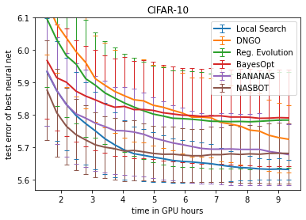
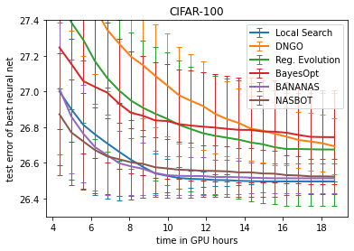
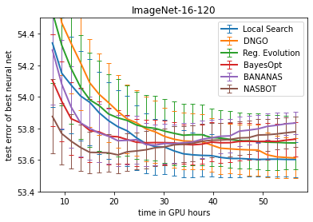
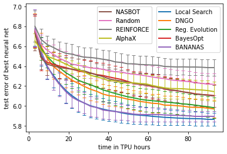
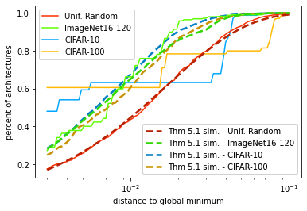
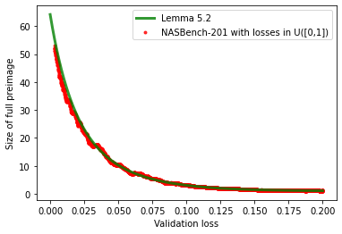

# Local Search for NAS

[Local Search is State of the Art for Neural Architecture Search Benchmarks](https://arxiv.org/abs/2005.02960)\
Colin White, Sam Nolen, and Yash Savani.\
_arXiv:2005.02960_.

We study the simplest versions of local search, showing that local search achieves state-of-the-art results on NASBench-101 (size 10^6) and NASBench-201 (size 10^4). We also show that local search fails on the DARTS search space (size 10^18). This suggests that existing NAS benchmarks may be too small to adequately evaluate NAS algorithms. See our paper for a theoretical study which characterizes the performance of local search on graph optimization problems, backed by simulation results.

## Requirements
- tensorflow == 1.14.0 (for nasbench experiments)
- pytorch == 1.2.0, torchvision == 0.4.0 (for DARTS experiments)
- matplotlib, jupyter
- nasbench (follow the installation instructions [here](https://github.com/google-research/nasbench))
- nas-bench-201 (follow the installation instructions [here](https://github.com/D-X-Y/AutoDL-Projects/blob/master/docs/NAS-Bench-201.md))

If you run experiments on DARTS, you will need the naszilla fork of the darts repo:
- Download the repo: https://github.com/naszilla/darts

## Run an experiment on nas-bench-101

To run an experiment on nas-bench-101, run
```
python run_experiments_sequential.py
```

## Run an experiment on DARTS
To run an experiment on DARTS, run
```
bash darts/run_experiments.sh
```


<p align="center">
  
  
  
  
  
  
</p>

  
